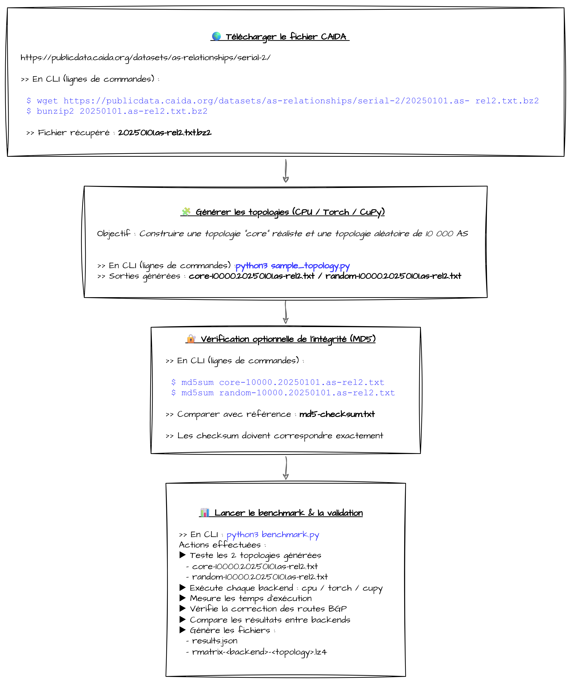

> [!IMPORTANT]
> ## 🙏 Crédits  
> Ce projet s'appuie sur l'outil **matrix-bgpsim**, développé par **M. Yihao Chen** (Tsinghua University).
>
> - **Dépôt officiel** : [matrix-bgpsim](https://github.com/yhchen-tsinghua/matrix-bgpsim)
> - **Auteur** : [Yihao Chen](https://github.com/yhchen-tsinghua)
> - **Références académiques** : [Porcupine Andrew - Publications](https://porcupineandrew.github.io/homepage/)

---

# Le projet Dock-BGPmatrix

Ce dépôt propose une solution simplifiée et rapide pour déployer l'outil **[matrix-bgpsim](https://github.com/yhchen-tsinghua/matrix-bgpsim)** dans un cadre de tests et de recherches.  
- Git : mise à disposition de la solution
- Docker engine : conteneurisation

👉🏽 Légèreté, rapidité, reproductibilité, isolation du contexte

> [!TIP]
> Attention toutefois à la partie accélération GPU qui n'est valable que sous certaines conditions. 
> En dehors de ce contexte de déploiement de l'outils `matrix-bgpsim` plusieurs paramètres peuvent influer son fonctionnement. 
> Plusieurs solutions ont été testées VM locales, VM cloud, installation en dur, ... et celle-ci reste la plus simple à plusieurs égards.


## Prérequis

Il est possible d'utiliser la distribution de votre choix, mais ici voici la configuration de base :

| `Ubuntu 24.04` ou plus | `git` | `docker` |
| ----------- | ----------- | ----------- |

💻 Mon système :
```
PC Portable ASUS  
CPU : Intel Core i9-14900HX  
RAM : 32 Go DDR5  
GPU : Nvidia RTX 4080-Laptop  
OS : Windows 11 + WSL 2 (distribution Ubuntu 24.04)  
```  
Pour la partie exploitation du GPU suivre le guide ici : [Nvidia container toolkit](http://docs.nvidia.com/datacenter/cloud-native/container-toolkit/latest/install-guide.html)  
> [!CAUTION]
> Sur PC portable, bien faire attention à être branché sur secteur car le GPU peut ne plus être détecté si ce n'est pas le cas (j'ai pu expérimenté le problème personnellement)

## Mise en place
### Clonage & construction des conteneurs

Pour récupérer et agencer les dossiers correctement exécutez ces commandes :

**Préparation du répertoire de travail**
```
git clone https://github.com/Newfile01/dock-BGPmatrix.git
cd dock-BGPmatrix
git clone https://github.com/yhchen-tsinghua/matrix-bgpsim.git
rm -rf .git
cd matrix-bgpsim
rm -rf .git
cd ..
```

### Arborescence attendue
```
📁 dock-BGPmatrix
├── README.md
├── 📁 dock-nct-py
│   └── 🐳Dockerfile
├── 🧠docker-compose.yml
├── 💲extract_infos.sh
├── 📁 image
...
├── 📁 jupy-notebook
│   └── 🐳Dockerfile
└── 📁 matrix-bgpsim
    ├── LICENSE
    ├── README.md
    ├── 📁 benchmark
    │   ├── 📄20250101.as-rel2.txt
    │   ├── 📁 asn_queries
    │   ├── benchmark.py
    │   ├── correctness_test.py
    │   ├── md5-checksum.txt
    │   └── sample_topology.py
    ├── docs
    ...
    ├── matrix_bgpsim
    ...
```

## Utilisation des conteneurs

Les éléments principaux à exploiter sont :
- 1 conteneur de calcul (dock-nct-py)
- 1 conteneur d'affichage (jupy-notebook)
- 1 IaC regroupant les deux précédents


---

## IaC

En vous plaçant à la racine de votre projet `📁 dock-BGPmatrix` vous pourrez exécuter les commandes suivantes

```
# Construction & lancement des conteneurs
docker compose up -d
```

### Calcul

Pour créer une topologie à partir des scripts fournis dans **matrix-bgpsim** ou simplement exploiter le dossier `📁 asn_queries` il est préférable d'utiliser ce conteneur :
```
# Naviguer dans le conteneur de calcul
docker exec -it bgpsim bash
```
> [!NOTE]
> <details>
> <summary><h5>🕸️ Création de topologie avec matrix-bgpsim</h5></summary>
>   
>  
>  
> Vous pouvez repartir d'un autre fichier CAIDA si vous préférez, ils sont disponibles à l'adresse : [Fichiers CAIDA](https://publicdata.caida.org/datasets/as-relationships/serial-2/)  
> Il faudra alors appliquer les modifications dans `sample_topology.py` avant de lancer la procédure
> </details>

> [!NOTE]
> <details><summary><h5>📁 asn_queries</h5></summary>
>
> 
> ### 🧭 ASN Queries — Analyse BGP modulaire pour matrix-bgpsim
>
> Petit programme modulaire en python permettant de tester quelques fonctions de l'outils **matrix-bgpsim**
> 
> ---
>
> #### 📁 Arborescence attendue
>
> ```
> 📁 asn_queries/
> ├── 📂 scripts/
> │   ├── __init__.py
> │   ├── io.py
> │   ├── asn.py
> │   ├── paths.py
> │   └── main.py
> |   └── stats.py
> |   └── menu.py
> |   └── references.py
> │
> └── 📂 queries/
>     ├── asn_present.txt
>     ├── asn_core.txt
>     ├── asn_branch.txt
>     └── asn_longest_path.txt
> ```
>
> ---
>
> #### 🧩 Détails des modules
>
> ---
>
> ##### 🔹 io.py — Gestion des entrées / sorties
> - Création et vérification du dossier queries/
> - Test d’existence des fichiers de résultats
> - Lecture / écriture centralisée des fichiers
> - Déplacement d’anciens fichiers si nécessaire
> ➡️ Garantit une exécution propre, reproductible et sans doublons.
>
> ---
>
> ##### 🔹 asn.py — Analyse des systèmes autonomes
> - Extraction des ASN présents dans la topologie
> - Classification des ASN en Core et Branch
> - Comptage et affichage des résultats
> - Calculs parallélisés via multiprocessing
> ➡️ Cœur logique de l’analyse BGP.
>
> ---
>
> ##### 🔹 paths.py — Chemins et relations AS
> - Calcul du chemin AS le plus long
> - Analyse des relations AS le long de ce chemin :
>   - Customer → Provider
>   - Peer → Peer
>   - Provider → Customer
> - Génération du tableau récapitulatif affiché en sortie
> ➡️ Partie analytique avancée du script.
>
> ---
>
> ##### 🔹 main.py — Point d’entrée
> - Orchestration de l’ensemble des modules
> - Vérification de l’existence des résultats avant recalcul
> - Affichage final des métriques et tableaux
> ➡️ Interface principale du script.
>
> #### 🛠️ Intégration dans matrix-bgpsim
> Depuis la racine du projet matrix-bgpsim : `mv asn_queries matrix-bgpsim/benchmark/`
>
> ```
> 📁 matrix-bgpsim/
> └── 📁 benchmark/
>     └── 📁 asn_queries/
>         ├── scripts/
>         └── queries/
> ```
>
> ▶️ Mode opératoire d’exécution
> Se placer dans le dossier benchmark/ puis lancer :
> ```
> python3 asn_queries/scripts/main.py
> ```
>
> 📌 Le script peut être relancé plusieurs fois sans effet de bord.
>
> 📊 Résultats attendus
> À l’exécution :
> - 📁 Création automatique du dossier queries/ si absent
> - 📄 Création ou réutilisation des fichiers :
>   - `asn_present.txt`
>   - `asn_core.txt`
>   - `asn_branch.txt`
>   - `asn_longest_path.txt`
> - 🔁 Aucun doublon de fichiers entre deux exécutions
>
> Affichage en sortie standard :
> - 🔢 Nombre total d’ASN présents
> - 🧠 Nombre d’ASN Core
> - 🌿 Nombre d’ASN Branch
> - 🧮 Longueur du chemin AS le plus long
> - 📊 Tableau récapitulatif des relations AS sur ce chemin
>
> </details>

### Affichage

Ce second conteneur a vocation à permettre l'affichage de script python en se basasnt sur Jupyter Notebook avec l'outils **matrix-bgpsim** d'installé dessus. Ceci permet de clarifier l'affichage voire même d'obtenir de beaux résultats graphiques 📊

Le notebook sera accessible à l'adresse : http://localhost:8889/?token=my-token  
  
Il s'agit d'un notebook intégrant un moteur d'exécution python et hébergé sous forme de site web.  
Il vous permettra d'utiliser matrix-bgpsim en tant que module python, d'importer d'autres modules et d'exécuter des scripts d'un seul tenant ou en plusieurs parties (les cellules d'une même page récupèrent les résultats des précédentes)  
  
❗Si vous rencontrez des problèmes de connexions référez-vous à la note ci-dessous "Usage du notebook".  

Vous pouvez en voir quelques exemples sur notre site détaillant le fonctionnement de l'outils : [exploitation de matrix-bgpsim](https://rsx217-bgpsim.notion.site/accueil)  


> [!NOTE]
> <details>
> <summary><h5>📊 Usage du notebook</h5></summary>
>  
> Le notebook est hébergé sur le conteneur et accessible via
> ```
> # Retrouver le token de connexion
> docker exec -it jupyter bash
> jupyter server list
> exit
> ```
>  
>  
> Vous pouvez repartir d'un autre fichier CAIDA si vous préférez, ils sont disponibles à l'adresse : [Fichiers CAIDA](https://publicdata.caida.org/datasets/as-relationships/serial-2/)  
> Il faudra alors appliquer les modifications dans `sample_topology.py` avant de lancer la procédure
> </details>

---
